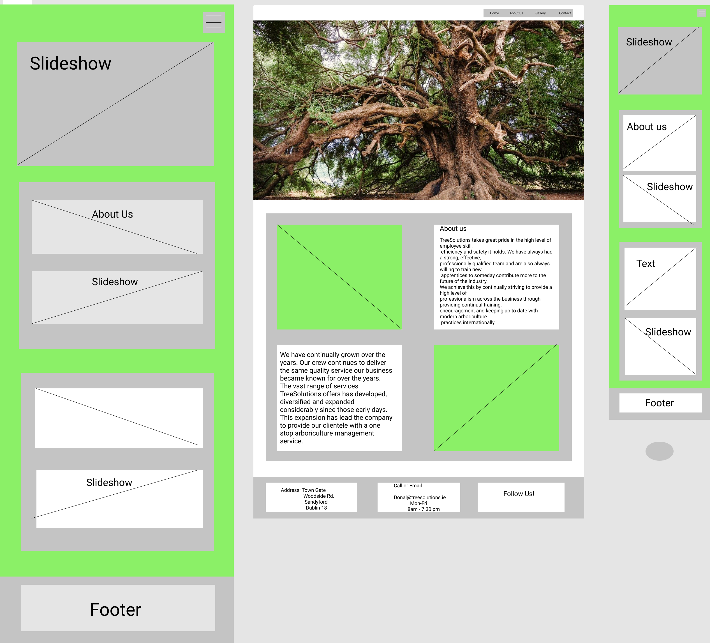
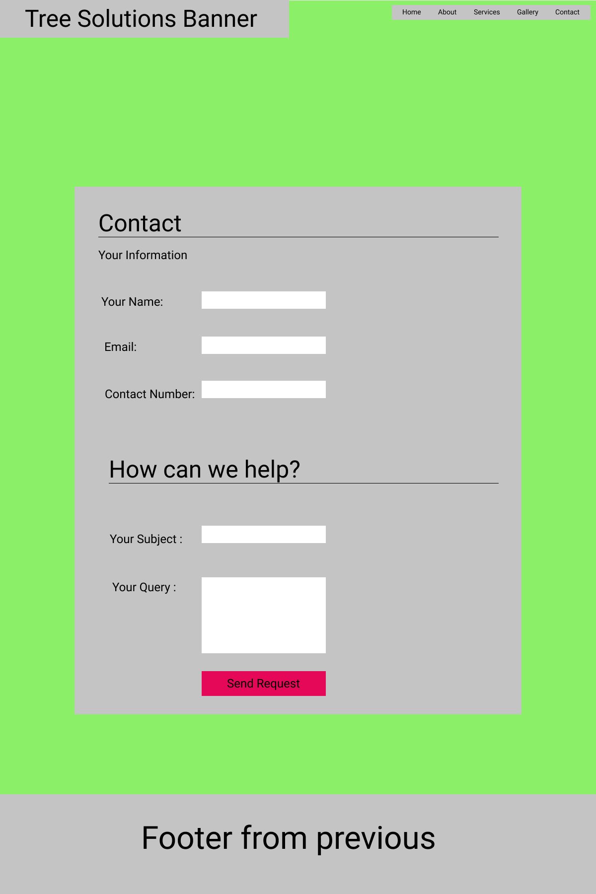
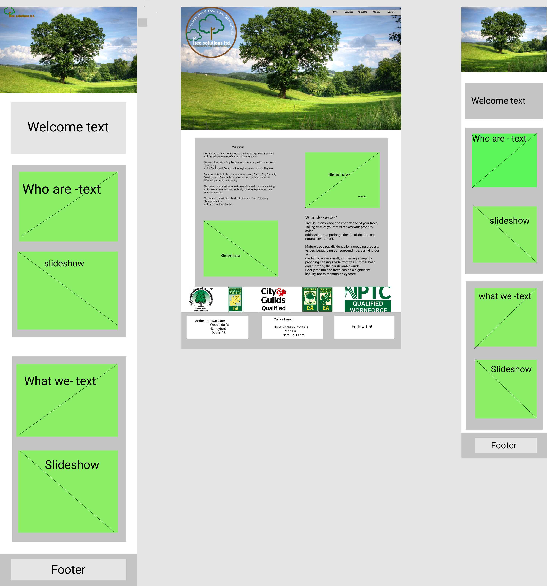
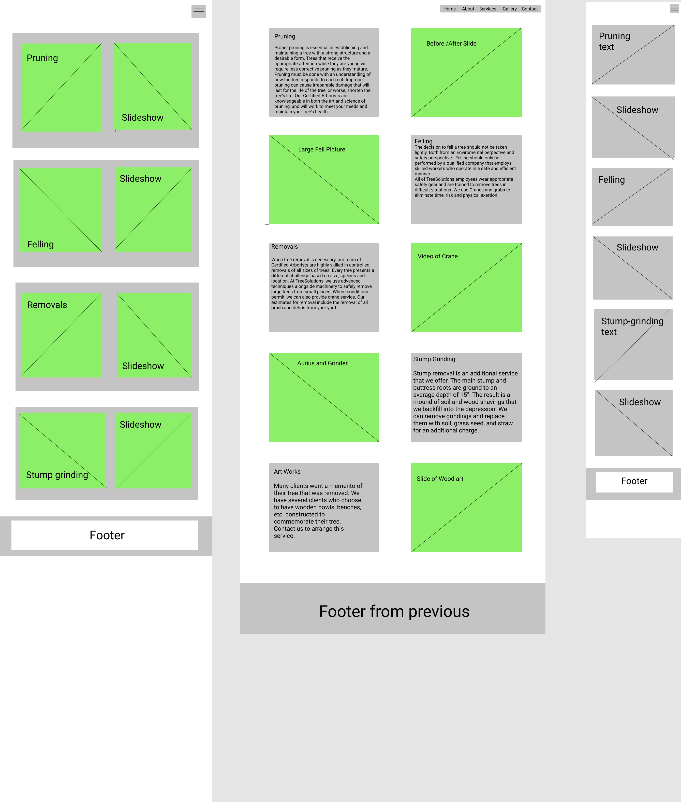

#**TreeSolutions Homepage**

[]


##**This is a business homepage for TreeSolutions(.)ie**


Tree Soltuions is an Industry leading company based in the hilly suburbs of Dublin City,
residing in Sandyford. They have been top competitors in Ireland for over 15 years now
and specialize in Professional Tree Care, habitat creation and Woodland diversity.
Clientele varies from Private Homeowners, Development / Landscape Companies
and Local Councils.

The services they specialize in are: Tree Assesments, Large / small and dangerous Removals, 
Site-clearance, Pruning and remedial works, firework, Mulch, stump removals.
Fully qualified, safe and competent workforce. 
Fully equiped for any job with an array of different machinery to
make sure budgets and schudules are met.           


**https://rootcanopy.github.io/TreeSolutions-Homepage/index.html**

##**UX**

This sites target demographic are oridinary people and business' in need of a professional opinion and 
a professional reliable service. This page can help them achieve this by providing efficient usability/interactivity,
simple content and layout with paragraphs with proven work ethic,
mobile first display, showcasing of previous work and consumer testimonials.  

Because Tree Solutions vehicles are on the roads so much, the mobile first display is the important
aspect because its going to be in public that most people see the company advertised and 
the quickest thing for anyone to do is google the web address that is seen.
    
[]
[]
[]
[]

##**User Stories**

```>*As a customer or potential customer, I want to see what professional previous background TreeSolutions has.```

```>*As a potential customer, I want to learn who TreeSolutions are and what skills and competencies she has before working on my trees.```

```>*As a potential customer, I want to see what experience and knowledge TreeSolutions has.```

```>*As a potential customer, I want to have a posibility to contact Anna via phone, email or contact form.```

##**Features**

(you should go over the different parts of your project, and describe each in a sentence or so.)

When beginning this project I had so cool things in my head that I wanted to try out but as I started 
coding I decided to keep it simple and basic because I felt i was wasting too much time trying to implement 
features that were just there for show rather than UX. 

The site features a standard layout. On the first page it has a really cool hero image looking up into the canopy 
of a conifer forest, showcasing how mystical our woodlands are.

Underneath is a embedded video of a technical dismantle that is a couple of years old but relevant and this 
is the type of smooth craftsmanship TreeSolutions is achieving.

In the footer of the pages, also kept basic, are all working contact links. Facebook, Phone, Email and Instagram.

On the following pages mostly consisting of Carousels, showcasing more of the specialized and highly technical work carried out
by this company.

I really enjoyed implementing the contact modal and it actually turned out better than I thought. Theres still a little bit of 
coding to do on it.
        
/*Throughout the entie website, I didnt take much code from elsewhere. The Bootstrap Navbar 
https://getbootstrap.com/docs/4.0/components/navbar/ and the burger icon I replaced as a tree from Font-Awesome, 
I thought that was a cool feature and I hope user realise this is the dropdown menu :).
I chose to keep it as simple as I could without the bussle of 
features that are just there for show making the build more complex than it needs to be.

The opening hero image I found on https://www.pexels.com/.

The background images on all the pages I got on google images and chopped and flipped it to make it look different.

Navbar suppresses 'burger icon' on mobile and tablet and also follows the scroll downwards.

The features will be on the homepage, I want to implement a slideshow gallary of previous work/ equipment. */
        
##**Existing Features

            <li> exam. Feature 1 - allows users X to achieve Y, by having them fill out Z</li>
            <li>...</li>
        </ul>

        <p> 
            example: For some/all of your features, you may choose to reference the specific project files that implement them,
            although this is entirely optional.

            In addition, you may also use this section to discuss plans for additional features to be implemented in the future:
        </p>
    <hr>

    <h2>Technologies Used</h2>

        <p>
            <ul>
                <li>Bootstrap was used for its mobile first application and efficiency for embedded styles. </li>
                <li>Font Awesome was used for some Icons for style and view</li>
                <li>Adobe Illustrator was used to create/edit the company logo for coloring as the orginal
                logo recieved didnt meet the style needs.
                <li>I plan on using EdrawMax for wireframe as having difficulty installing Balsamiq on linux with wine</li>
            </ul> 
        </p>
    <hr>

    <h2>Testing</h2>

        <p>
            This will have to be added to-do list. 
        </p>
    <hr>

    <h2>Deployment</h2>

        <p>
            This will also be added to to-do.
        </p>
    <hr>

    <h2>Credits</h2>

    <h3>Contents</h3>
        <ul>
            <li>Donal for Company Info</li>
        </ul>
    <hr>

    <h3>Media</h3>

        <p>
            ALl media is original content taken from the companies google photos.
        </p>

    <h3>Acknowledgements</h3>


